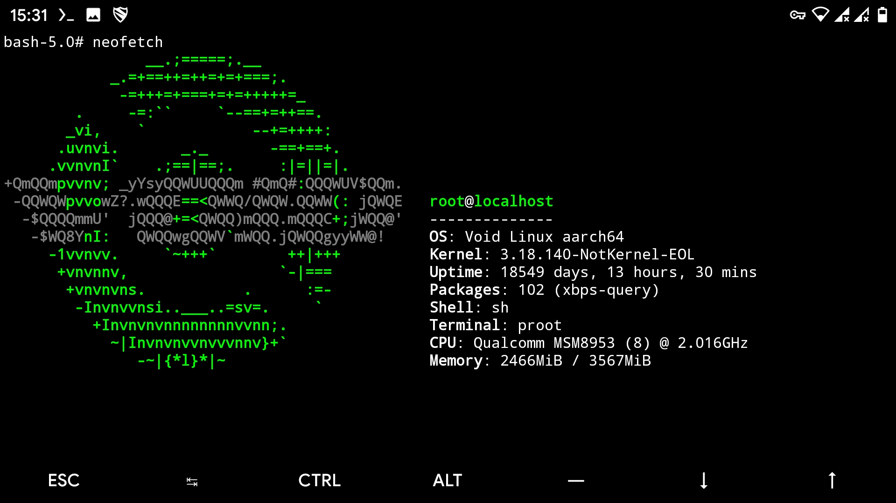

# Void-In-Termux
This is a script by which you can install Void nethunter (Void Linux) in your termux application without rooted phone.
This has scripts modified from Nethunter-In-Termux. So far, the update has worked, and df.
### Steps For Installation
1. Download script in **HOME** `curl -LO https://raw.githubusercontent.com/oSoWoSo/Void-In-Termux/zen0bit-patch-1/TermuxVoid.sh`
2. Give execution permission `chmod +x TermuxVoid.sh`
3. Run script `bash ./TermuxVoid.sh`
4. Now just start Void Linux `startvoid`

### Compulsory Steps For First Time Use (Only for First Time After Installation)(Twice)
1. #xbps-install -Su

#### You have any idea to improve ? So Just give PR

Tested:

